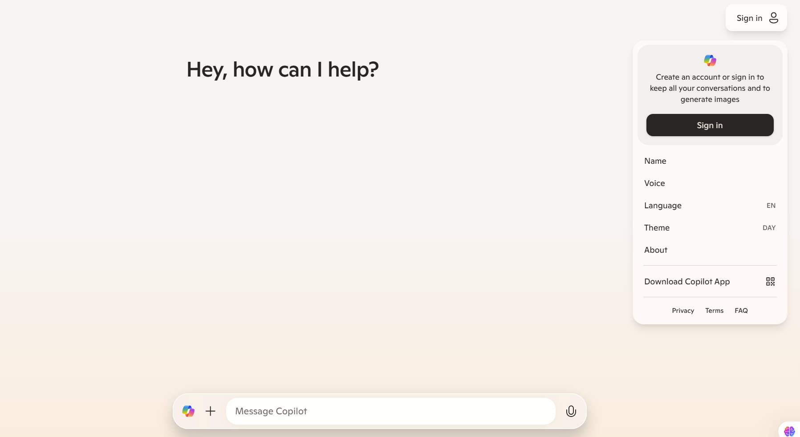

# Get started with GitHub Models and Microsoft Copilot

## Prerequisite

To complete the lab, you will need:

- A GitHub account. If you don't have one, you can [sign up for free](https://github.com/).
- A Microsoft Copilot account. Ensure you have access to Copilot to interact with the lab effectively. If you don't have one, you can [sign up for free](https://copilot.microsoft.com/).

## GitHub Models

What is [**GitHub Models**](https://github.com/marketplace/models)? GitHub Models is a feature available on the GitHub Marketplace that allows users to interact with various large language models (LLMs) through Copilot Chat. This feature provides a streamlined interface for users to ask questions, get recommendations, and run inferences using the models listed on the GitHub Marketplace.

In this workshop we will be working with GitHub Models as one of our tools. First, once you have signed into your GitHub account, you can access the [GitHub Models using this link.](https://github.com/marketplace/models)

### GitHub Models chat Playground

On GitHub Models, you can select, **OpenAI GPT-4o** model to start interacting with the models.

The model playground is made up of the following components:

1. **Model Selector**: This section allows us to change between our deployed models.
1. **Compare**: This section allows us to compare multiple models.
1. **System prompt Box**: Here is where we enter instructions for the model, previous to the user interaction.
1. **Add your data**: Azure AI Foundry portal supports providing the deployed models with external data, allowing for better search and context.
1. **Parameters**: This tab contains the models detailed settings, such as temperature, max tokens, response format, top P and stop.

1. **Details**: This tab contains the models detailed information including languages supported by the model.
1. **Chat Box**: The chat box is where we will see our interactions with the model in the form of chat messages.
1. **Prompt Box**: This is where we type the prompts we want to send to the model.

## Microsoft Copilot
[**Microsoft Copilot**](https://copilot.microsoft.com/) on the other hand, is an advanced AI companion created by Microsoft, designed to assist users with a wide range of tasks by serving as an intelligent and engaging partner. Key features include information retrieval, idea generation, support and advice, creative assistance, and engaging interactions. Copilot enhances personal productivity, supports professional workflows, and aids educational learning by providing accurate explanations, brainstorming help, problem-solving guidance, and creative project support, all while ensuring interactions are enjoyable and informative.

### Microsoft Copilot playground

The Copilot playground is made up of the following components:

1. **Settings tab**: This section allows us to configure our interactions such as language and audio voice.
1. **Home Icon**: Using this button you can go back to the homepage and access your history
1. **Attachment icon**: This icon allows you to add images and attachments to you prompts.
1. **Voice icon**: This button all ows us to interact with Copilot using Audio.
1. **Chat Box**: The chat box is where we will see our interactions with the model in the form of chat messages.
1. **Prompt Box**: This is where we type the prompts we want to send to the model.

> [!NOTE]
> To ensure you can interact with audio and generate images, ensure you sign in to Microsoft Copilot

Move to [Text Generation](02_Text_Generation.md) to proceed to the Text Generation section.