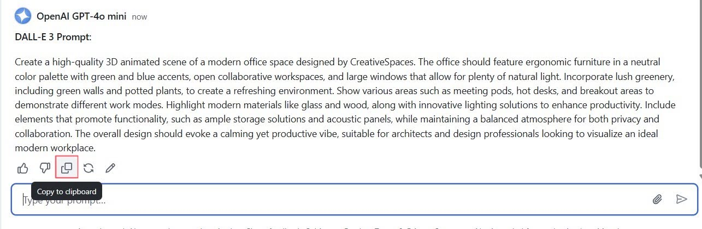

# Part 2: Image Generation

Welcome to part 2 of this workshop, where we will interact with a text-to-image model, DALL-E 3. 

> [!TIP]
> What is DALL-E 3? DALL-E 3 is a neural network based model that can generate graphical data from **natural language input**. Put more simply, you can provide DALL-E 3 with a **description** and it can generate an appropriate image.

## Creating your first images

To create your first image, we will switch to [Microsoft Copilot](https://copilot.microsoft.com/):

> [!NOTE]
> To ensure you can interact with audio and generate images, ensure you sign in to Microsoft Copilot


1. Navigate to the  **Microsoft Copilot** and make sure you are signed in.
2. In the playground, find the text box labeled _"Message Copilot"_ and type in your prompt.
3. After typing your message, an **arrow icon** button will appear. Click the button submit your image description to the model deployment.
4. After sending your query, wait a moment for the model to process and respond. The response will appear in the window below your input.

Let's begin with generating an image by entering a basic prompt in the description box, then clicking on generate:


```a watercolor painting of Chicago skyline```


This will generate something like the following:


Images generated by DALL-E 3 are original; they are not retrieved from a curated image catalog. In other words, DALL-E 3 is not a search system for finding appropriate images - it is an artificial intelligence (AI) model that generates new images based on the data on which it was trained.

### Be specific

Details allow for more accurate responses. Similar to text generation, image generation models benefit greatly from detailed descriptions of what you want to generate.

1. For example, enter the following prompt:

    ```A logo for an adventure brand```

2. Then select **Generate** and view the image that is generated.

    

3. Now, let's modify the prompt by adding more details to the description:


    ```A logo combining a tent silhouette and stars, with a rustic feel for an adventure brand.```

4. Select **Generate** once again and compare the results.

    

### Best practices

To create effective and accurate images with DALL-E 3, here are some best practices to follow:

1. **Clear and descriptive prompts**: Craft your text prompts to be clear and detailed. The more specific you are with your description, the more likely DALL-E 3 will generate an image that matches your request. Include attributes such as the subject, action, environment, style, and any important details.

1. **Use of adjectives**: Employ adjectives and adverbs to describe the qualities, emotions, and characteristics you want the image to convey. This helps in refining the generated image to better match your vision.

1. **Balance detail with simplicity**: While details are important, overly complicated or contradictory prompts can confuse the AI, leading to unexpected results. Aim for a balance where your description provides enough context without being overly convoluted.

1. **Experiment with different styles**: Specify artistic styles or influences if you want your image to have a particular aesthetic. For example, you could ask for an artistic image.

1. **Iterative approach**: Often, the first image generated may not be perfect. Use it as a starting point and iteratively refine your prompt based on the output to get closer to your desired result.

1. **Aspect ratio and composition**: If you have a preference for the image's composition or aspect ratio, include it in your prompt. For example, you might request a landscape-oriented image or a portrait with a subject off-center.

1. **Cultural and contextual references**: If appropriate, include cultural or historical references to provide additional context that can help guide the image generation process.

1. **Responsible AI considerations**: Be mindful of the Responsible AI implications of your prompts. Avoid creating images that are offensive, perpetuate stereotypes, or infringe on copyrights.

1. **Testing and learning**: Experiment with different prompts to understand how DALL-E 3 interprets various descriptions. This learning process can help you improve the precision of your prompts over time.

1. **Following guidelines**: Adhere to OpenAI's use-case policy and content guidelines when creating prompts. Avoid requesting images that are not allowed as per OpenAI's content policy.

## Brand Mascot Creation

For this workshop, we will leverage the capabilities of DALL-E 3 to generate images for a brand mascot, focusing on different themes such as friendly animals, robots, or abstract figures. 

Let's begin by generating a brand mascot. Consider prompts like:

```A friendly robot mascot with a smiling face, designed in a cartoon style.```


```A playful fox mascot with a colorful scarf, representing agility and creativity.```

```An abstract figure with geometric shapes, conveying innovation and technology.```

## Advanced Prompting

Now that we have seen some basic prompts, let's try something new.

>[!alert] Make sure the System Message is Empty. 

We are now going to try to generate an image based on a prompt generated by gpt-4o-mini.

1. Navigate back to the **GitHub Models**.

2. Under **System prompt** erase the existing message to reset the system message back to default.

3. In the **chat box** add a thorough description of the product we want to create an image for and submit your request to the model.

```
Generate a prompt for DALL-E 3 from this product description:

The 3D Animated Office Space Design by CreativeSpaces offers a modern, interactive representation of a professional work environment. This design concept includes ergonomic furniture, open and collaborative workspaces, greenery for a touch of nature, and large windows to maximize natural light. The layout also incorporates meeting pods, hot desks, and breakout areas for different work modes. The office has a neutral color palette, with accents of green and blue to create a calming yet productive atmosphere.

The 3D Animated Office Space Design is intended for use by architects, interior designers, and companies looking to revamp their workspaces. It highlights the importance of balancing privacy with collaboration, including quiet zones for focused work and shared areas for team interactions. The space features modern materials like glass and wood, combined with innovative lighting solutions to enhance productivity and employee well-being.

Beyond its aesthetic appeal, the 3D Animated Office Space Design is designed with functionality in mind. It includes ample storage solutions, acoustic panels to reduce noise, and modular furniture that can be rearranged to suit different needs. The green walls and potted plants throughout the office create a refreshing environment that promotes creativity and reduces stress. The design is presented in a high-quality 3D animation, providing a realistic walkthrough that allows clients to visualize the space effectively.
```

4. Once you get the response, click on **Copy response to clipboard**.



5. Navigate back to the **Copilot** to generate an image from the prompt response.

5. Submit the prompt and notice how detailed the image comes out to be.


> [!NOTE]
> If Copilot generates a text response, add in an additional prompt to create an image based on the prompt.

## Next steps

Congratulations! You have now completed the second part of the lab, and have generated different image assets. In the next part of the lab, you will learn how to use the model for multimodal requests.

Move to [Multimodality](04_Multimodal_Interfaces.md) to proceed to the Multimodality section.
