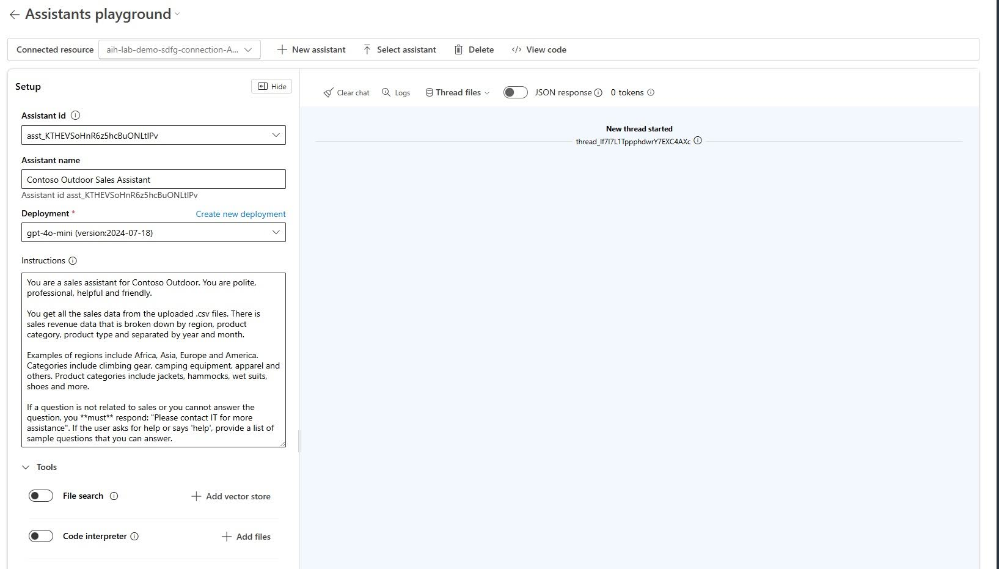
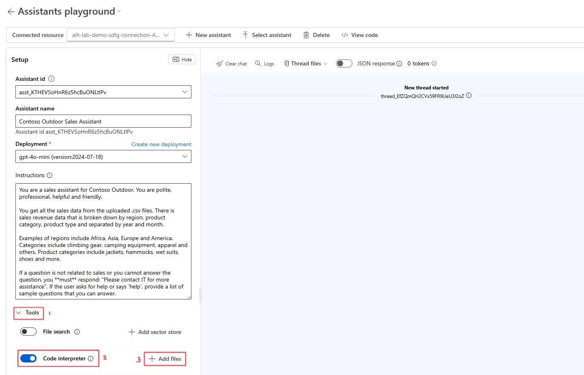

# Part 4 - Azure AI Assistants

Welcome to Part 4 of this workshop! 

So far, we have interacted with Large Language Models in many different ways. However, these interactions have been isolated and tied to a very specific purpose. **Azure OpenAI Assistants** represent the next step in our interactions, as they help us integrate previous interactions into one solution.


> [!TIP] 
> **What is an Azure OpenAI Assistant?** Azure OpenAI Assistant is a new feature of Azure OpenAI Service, that makes it easier for developers to create applications with sophisticated copilot-like experiences that can sift through data, suggest solutions, and automate tasks. It integrates capabilities such as state management, context association, chat threads, and code execution, making it easier to access third-party extensions​.

Previously, building custom AI Assistants needed heavy lifting even for experienced developers. While the chat completions API is lightweight and powerful, it's inherently stateless, which means that developers had to manage conversation state and chat threads, tool integrations, retrieval documents and indexes, and execute code manually.

Azure OpenAI Assistants, as the stateful evolution of the chat completion API, provides a solution for these challenges. Azure OpenAI Assistants support persistent automatically managed threads. This means that as a developer you no longer need to develop conversation state management systems and work around a model’s context window constraints. The Assistants API will automatically handle the optimizations to keep the thread below the max context window of your chosen model. Once you create a Thread, you can simply append new messages to it as users respond. Assistants can also access multiple tools in parallel, if needed. Some of these tools include:
- **Function Calling**
- **Code Interpreter**
- **File Search**

In this section, we will be covering Code Interpreter and in the next, Function Calling.

## Understanding the Components of Assistants

To begin working with Azure OpenAI Assistants, it is important to understand and address the different components that take part in its functionality.

As we now know, an **Assistant** is simply a Custom AI that uses Azure OpenAI models in conjunction with tools. This is created first.

The next step once the Assistant has been created, is to create a **Thread**. A **Thread** is a conversation session between an Assistant and a user. Threads store Messages and automatically handle truncation to fit content into a model’s context.

The **Messages** are created by either the Assistant or an user, include text, images and other files. These are stored as a list on the thread.

Lastly, we can **Run** the Assistant. This means activating an Assistant to begin running base on the contents of the Thread. The Assistant uses its configuration and the *Thread’s Messages* to perform tasks by calling models and tools. As part of a Run, the Assistant *appends Messages to the Thread*.

## Creating the Assistant

1. Start by clicking on the **Assistants** Playground. Here you will see the different components of the Playground. Click **+ create an assistant** to get started.


2. In the **Deployments** section, ensure you select **gpt-4o-mini** model.

    >[!TIP] 
    > **Ensure that you chose the correct deployment**. It should say **gpt-4o-mini** along with its version. 

2. Next, let's name our assistant. Type the following in the Assistant Name textbox:

    ```Contoso Outdoor Sales Assistant```

3. Next, we can provide the Assistant with an **instruction**. Similar to the *System Message* we saw in previous sections, it provides the Assistant with goals to follow. Navigate to the **Prompt** tab and copy the following instructions into the Instructions textbox.

    ``` 
    You are a sales assistant for Contoso Outdoor. You are polite, professional, helpful and friendly.

    You get all the sales data from the uploaded .csv files. There is sales revenue data that is broken down by region, product category, product type and separated by year and month.

    Examples of regions include Africa, Asia, Europe and America. Categories include climbing gear, camping equipment, apparel and others. Product categories include jackets, hammocks, wet suits, shoes and more. 

    If a question is not related to sales or you cannot answer the question, you **must** respond: "Please contact IT for more assistance". If the user asks for help or says 'help', provide a list of sample questions that you can answer.
    ```

    

    >[!NOTE]
    >How many prompt engineering techniques from the previous sections are you able to identify in this prompt? For clues, check Part 2 of the workshop.

4. Click on the **Tools** tab, and click to enable **Code Interpreter** then click **Add files**.

    

6. On the pop up window, click on **Upload Local Files** and select the `Contoso_Sales_Revenue.csv` file on your Desktop and click on *Open*.
    

    >[!NOTE]
    > If you cannot find the file on your desktop, you can download it from [here](assets/Contoso_Sales_Revenue.csv).

7. Click on the **Attach** button. You should now see the file under the *Code Interpreter* tool.

The assistant is now ready for us to interact with it.

## Interacting with our Assistant

1. Let's begin by typing `help` in the chat box. You will notice this starts a New Thread. 
You will notice that we get a series of sample questions that we can test. Test one of the questions and see what the assistant replies!

2. Next, let's try a specific query. Type the following:

    ```What are the total sales for Europe broken down by category? ```

    You will notice the assistants makes use of the code interpreter to provide you with an answer.

3. Now, let's try working with this data. Type the following prompt:

    ```Put this data in a graph. ```

    Through code interpreter, the Assistant is able to convert the structured data into a graph!

4. If you would like to see another type of graph, try the following prompt:

    ```What is the trending product category? ```

    The assistant should provide you with a graph showcasing a trending product by carrying out an analysis of the sales revenue data overtime.

Congratulations! You have now completed the last part of the workshop and have learnt what Azure OpenAI Assistants are, how they work and how to create one using Azure AI Studio.

Click **Next** to advance to the Summary section of the workshop.